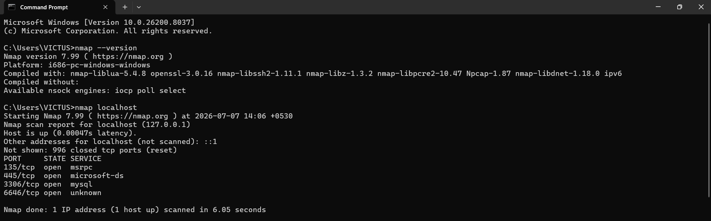
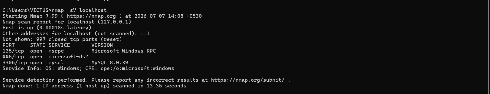
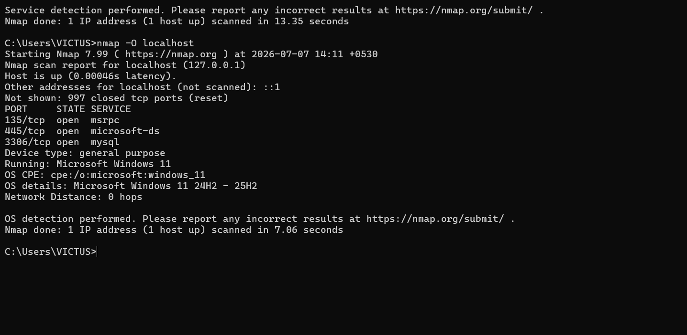

# Local Network Security Assessment Using Nmap

## Project Overview

This project demonstrates a basic network security assessment performed on a local Windows machine using Nmap.

The objective of this assessment was to identify open ports, detect running services, determine operating system information, and analyze potential security risks associated with exposed services.

This project was completed as part of the Oasis Infobyte Cyber Security Internship.

---

## Objectives

The objectives of this project were:

- Perform network reconnaissance using Nmap
- Identify open TCP ports
- Detect running services and software versions
- Perform operating system detection
- Analyze security risks related to exposed services
- Provide security recommendations

---

## Tools Used

| Tool | Purpose |
|------|---------|
| Nmap 7.99 | Network scanning and service detection |
| Windows 11 | Target operating system |
| Command Prompt | Running Nmap commands |

---

## Assessment Scope

Target:
localhost (127.0.0.1)

The assessment was performed only on the local machine for educational purposes and authorized security testing.

---

## Methodology

### 1. Basic Port Scan

Command: nmap localhost

Purpose:

To discover open TCP ports and identify available services running on the system.

---

### 2. Service Version Detection

Command: nmap -sV localhost

Purpose:

To identify the services running on open ports and determine their software versions.

---

### 3. Operating System Detection

Command: nmap -O localhost

Purpose:

To identify the operating system details of the target machine.

---

## Findings Summary

| Port | Service | Risk Level |
|------|---------|------------|
| 135 | Microsoft RPC | Medium |
| 445 | SMB / Microsoft-DS | Medium to High |
| 3306 | MySQL Database | Medium |

---

## Security Recommendations

The following security improvements are recommended:

- Keep operating systems and software updated with security patches.
- Disable unnecessary services to reduce the attack surface.
- Configure firewall rules to restrict unauthorized access.
- Use strong authentication mechanisms.
- Regularly review open ports and running services.

---

## Skills Demonstrated

- Network reconnaissance
- Port scanning
- Service enumeration
- OS detection
- Vulnerability assessment
- Security documentation
- Risk analysis

---

## Ethical Considerations

The scanning activity was performed only on my own local system.

Network scanning should only be performed on systems where proper authorization has been provided.

---
---

## Screenshots

### 1. Basic Port Scan

The basic Nmap scan was performed to identify open ports and available services on the target machine.

---

### 2. Service Version Detection

Service detection was performed to identify running services and their software versions.

---

### 3. Operating System Detection

OS detection was performed to identify the operating system details of the target machine.

---
## Author

Akshita Kaul

Cybersecurity Student
